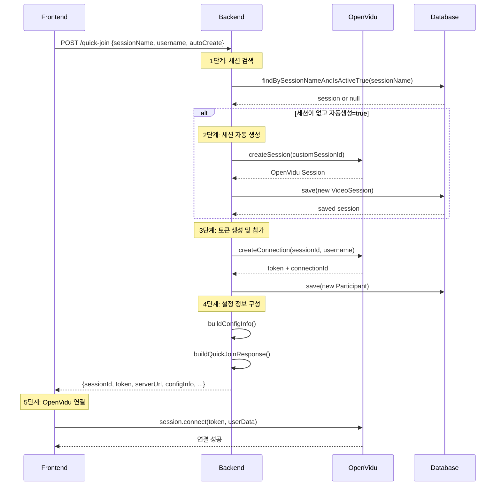
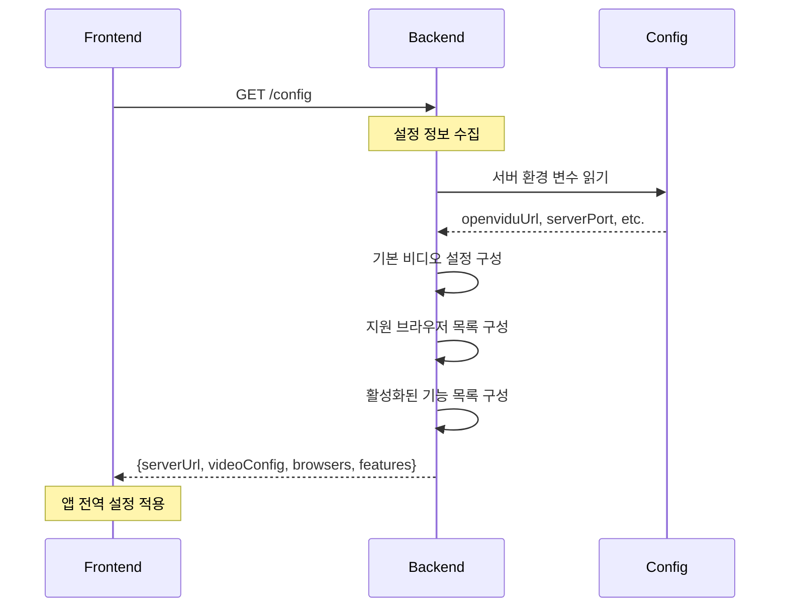
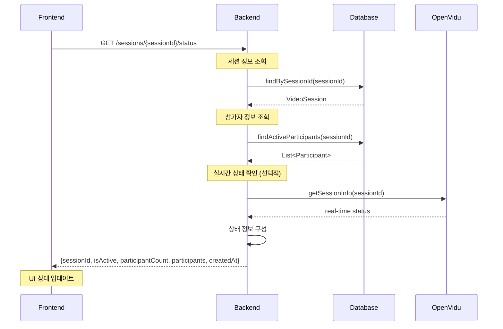
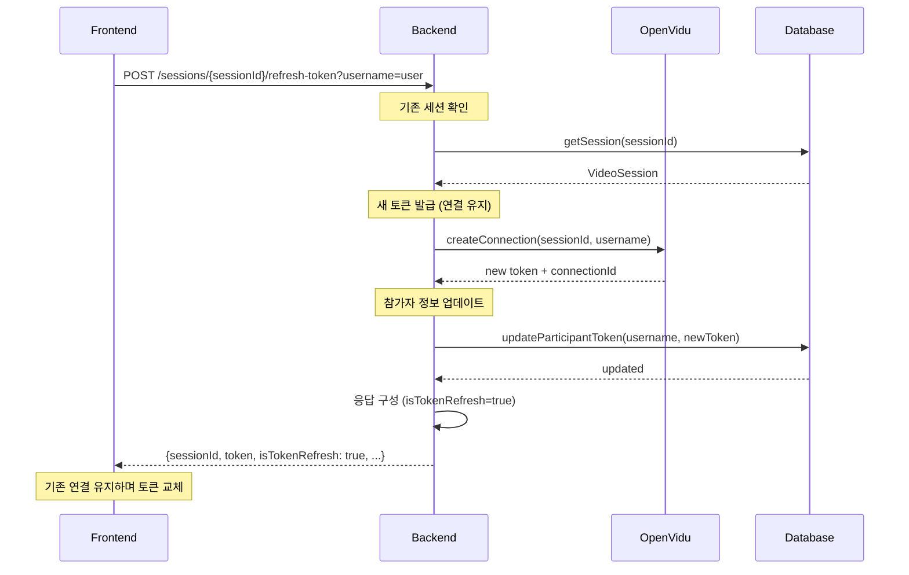
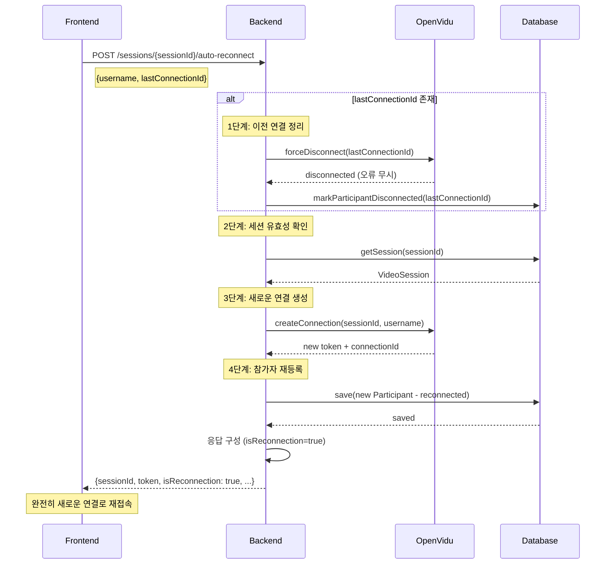
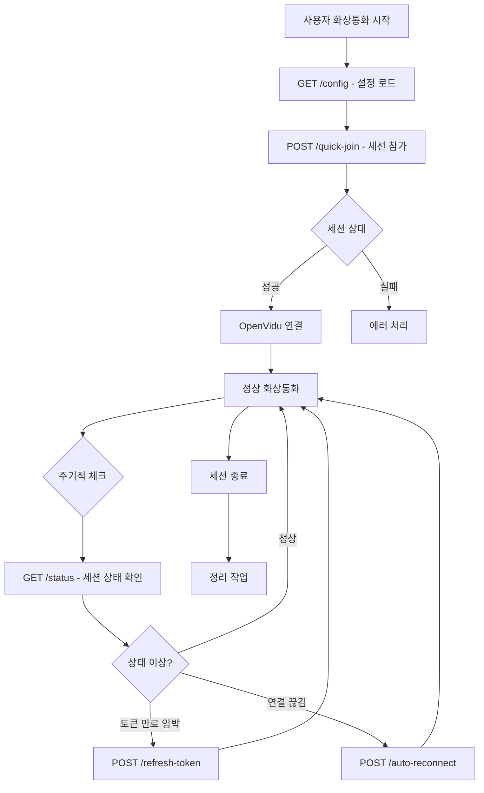

# OpenVidu 백엔드 고급 API 구현 가이드 

## 👨‍💻 백엔드 개발자의 역할과 책임

### 🎯 **이 가이드의 목적**
프론트엔드 개발자의 작업을 **70% 단축**시키기 위해, **복잡한 OpenVidu 로직을 백엔드로 이관**하여 프론트엔드는 간단한 API 호출만으로 화상통화를 구현할 수 있도록 하는 고급 API를 개발하는 것입니다.

### 🔄 **백엔드 개발자 역할의 변화**

#### 🔴 **기존 방식 (프론트엔드 개발자가 고생)**
```
백엔드: 기본 CRUD API만 제공
├── POST /sessions (세션 생성)
├── POST /sessions/{id}/join (세션 참가)
└── DELETE /sessions/{id}/leave (세션 나가기)

프론트엔드: 복잡한 OpenVidu 로직 직접 처리
├── OpenVidu 서버 설정 관리
├── 토큰 생성 및 갱신 로직
├── WebSocket URL 리디렉션
├── 세션 연결 상태 관리
├── 네트워크 오류 시 재연결 로직
├── 에러 처리 및 예외 상황 대응
└── 미디어 스트림 생명주기 관리
```

#### 🟢 **새로운 방식 (백엔드가 복잡성 흡수)**
```
백엔드: 고급 API로 모든 복잡성 처리
├── POST /advanced/quick-join (원클릭 참가)
├── GET /advanced/config (완성된 설정 제공)
├── GET /advanced/sessions/{id}/status (실시간 상태)
├── POST /advanced/sessions/{id}/refresh-token (토큰 갱신)
├── POST /advanced/sessions/{id}/auto-reconnect (자동 재연결)
└── + 내부적으로 모든 OpenVidu 복잡 로직 처리

프론트엔드: 간단한 API 호출 + UI만
├── 원클릭 API 호출
├── 받은 토큰으로 OpenVidu 연결
└── UI 이벤트 처리
```

### 🎯 **백엔드 개발자의 주요 책임 범위**

#### ✅ **새로 담당해야 하는 영역**
1. **OpenVidu 복잡성 관리**
   - OpenVidu 서버 연결 설정 자동화
   - 토큰 생성, 갱신, 만료 처리 자동화
   - 세션 생명주기 전체 관리

2. **프론트엔드 편의 API 제공**
   - 원클릭 세션 참가 API
   - 완성된 설정 정보 자동 제공
   - 실시간 세션 상태 모니터링 API

3. **에러 처리 및 복구 자동화**
   - 네트워크 오류 시 자동 재연결
   - 토큰 만료 전 자동 갱신
   - 연결 실패 시 재시도 로직

4. **성능 및 안정성 최적화**
   - 세션 상태 캐싱
   - 비동기 처리 최적화
   - 메모리 누수 방지

#### 🔄 **기존 책임에서 확장되는 영역**
- **기존**: 간단한 CRUD API
- **확장**: OpenVidu 통합 및 복잡한 비즈니스 로직 처리

#### 🚫 **여전히 담당하지 않는 영역**
- ❌ 프론트엔드 UI/UX 설계
- ❌ React 컴포넌트 구조
- ❌ 클라이언트 사이드 렌더링
- ❌ 브라우저 호환성 처리

### 📊 **백엔드 개발로 인한 전체 프로젝트 효과**

| 지표 | 기존 방식 | 개선된 방식 | 개선 효과 |
|------|-----------|-------------|-----------|
| **프론트엔드 개발 시간** | 7-10일 | 2-3일 | **70% 단축** |
| **백엔드 개발 시간** | 2-3일 | 3-5일 | **+2일 증가** |
| **전체 개발 시간** | 9-13일 | 5-8일 | **40% 단축** |
| **프론트엔드 코드 복잡도** | 높음 | 낮음 | **80% 감소** |
| **백엔드 코드 복잡도** | 낮음 | 중간 | **적정 수준** |
| **유지보수성** | 어려움 | 쉬움 | **크게 개선** |
| **에러 발생률** | 높음 | 낮음 | **안정성 향상** |

### 🚀 **백엔드 개발자가 얻는 이점**

#### ✅ **기술적 성장**
- OpenVidu 전문성 확보
- 복잡한 시스템 통합 경험
- 실시간 통신 기술 이해도 향상
- API 설계 역량 강화

#### ✅ **프로젝트 기여도**
- 프론트엔드 개발 속도 대폭 향상
- 전체 시스템 안정성 책임
- 핵심 비즈니스 로직 소유권
- 팀 생산성 향상의 핵심 역할

#### ✅ **업무 만족도**
- 복잡한 문제 해결의 성취감
- 팀원들의 업무 효율성 향상 기여
- 시스템 아키텍처 설계 주도권

## 📋 백엔드 개발자 작업 개요

### 🎯 **백엔드 개발자가 구체적으로 해야 할 일**

#### 📝 **1. 새로운 파일 생성 (5개 파일)**
- [ ] `VideoCallAdvancedController.java` - 고급 API 엔드포인트
- [ ] `VideoCallAdvancedService.java` - 핵심 비즈니스 로직
- [ ] `QuickJoinRequest.java` - 원클릭 참가 요청 DTO
- [ ] `QuickJoinResponse.java` - 원클릭 참가 응답 DTO  
- [ ] `SessionConfigResponse.java` - 프론트엔드 설정 정보 DTO
- [ ] `SessionStatusResponse.java` - 실시간 세션 상태 DTO

#### 🔧 **2. 핵심 메서드 구현 (5개 메서드)**
```java
// VideoCallAdvancedService.java에서 구현할 메서드들
public QuickJoinResponse quickJoin(String sessionName, String username, Boolean autoCreateSession) {
    // 세션 찾기 → 없으면 생성 → 참가 → 완성된 설정 응답
}

public SessionConfigResponse getFrontendConfig() {
    // OpenVidu URL, WebSocket 설정, 기본 비디오 설정 등 자동 제공
}

public SessionStatusResponse getSessionStatus(String sessionId) {
    // 실시간 세션 상태, 참가자 목록, 연결 상태 정보
}

public QuickJoinResponse refreshToken(String sessionId, String username) {
    // 기존 연결 유지하면서 새 토큰 발급
}

public QuickJoinResponse autoReconnect(String sessionId, String username, String lastConnectionId) {
    // 이전 연결 정리 → 새 연결 생성 → 자동 복구
}
```

#### 📋 **3. API 엔드포인트 추가 (5개 API)**
- [ ] `POST /api/video-call/advanced/quick-join` - 원클릭 세션 참가
- [ ] `GET /api/video-call/advanced/config` - 프론트엔드 설정 정보
- [ ] `GET /api/video-call/advanced/sessions/{id}/status` - 실시간 세션 상태
- [ ] `POST /api/video-call/advanced/sessions/{id}/refresh-token` - 토큰 갱신
- [ ] `POST /api/video-call/advanced/sessions/{id}/auto-reconnect` - 자동 재연결

#### ⏱️ **4. 예상 개발 시간**
- **1일차**: DTO 클래스 생성 및 기본 구조 설정
- **2일차**: 원클릭 참가 API 구현 및 테스트
- **3일차**: 자동 재연결 및 토큰 갱신 API 구현
- **4일차**: 실시간 상태 조회 및 설정 API 구현
- **5일차**: 통합 테스트 및 문서화

### 📊 **개발 후 기대 효과**
- 🚀 프론트엔드 개발 시간: **7-10일 → 2-3일**
- 🔧 프론트엔드 코드 복잡도: **300-500줄 → 50-100줄**
- ⚡ API 호출 수: **5-8개 → 1-2개**
- 🛡️ 에러 처리: **프론트엔드 복잡 로직 → 백엔드 자동 처리**

---

## 🏗️ 구현해야 할 새로운 컴포넌트들

### 1. **고급 컨트롤러 구현**

#### 📁 `VideoCallAdvancedController.java`
```java
@RestController
@RequestMapping("/api/video-call/advanced")
@RequiredArgsConstructor
@Slf4j
@Tag(name = "고급 화상통화", description = "프론트엔드 작업 간소화를 위한 고급 OpenVidu API")
public class VideoCallAdvancedController {

    private final VideoCallAdvancedService videoCallAdvancedService;

    @PostMapping("/quick-join")
    @Operation(summary = "원클릭 세션 참가", description = "세션 생성부터 토큰 발급까지 한 번에 처리")
    public ResponseEntity<QuickJoinResponse> quickJoin(@Valid @RequestBody QuickJoinRequest request) {
        // 구현 내용: 세션 자동 생성 + 참가 + 설정 정보 제공
    }

    @GetMapping("/config")
    @Operation(summary = "프론트엔드 설정 정보", description = "OpenVidu 연결에 필요한 모든 설정 정보 제공")
    public ResponseEntity<SessionConfigResponse> getConfig() {
        // 구현 내용: 완성된 OpenVidu 설정 정보 제공
    }

    @GetMapping("/sessions/{sessionId}/status")
    @Operation(summary = "실시간 세션 상태", description = "세션의 실시간 상태와 참가자 정보 제공")
    public ResponseEntity<SessionStatusResponse> getSessionStatus(@PathVariable String sessionId) {
        // 구현 내용: 세션 상태, 참가자 목록, 연결 상태 등
    }

    @PostMapping("/sessions/{sessionId}/refresh-token")
    @Operation(summary = "토큰 갱신", description = "세션 토큰을 자동으로 갱신")
    public ResponseEntity<QuickJoinResponse> refreshToken(@PathVariable String sessionId, @RequestParam String username) {
        // 구현 내용: 기존 연결 유지하면서 새 토큰 발급
    }

    @PostMapping("/sessions/{sessionId}/auto-reconnect")
    @Operation(summary = "자동 재연결", description = "네트워크 오류 시 세션 자동 재연결 처리")
    public ResponseEntity<QuickJoinResponse> autoReconnect(
            @PathVariable String sessionId,
            @RequestParam String username,
            @RequestParam String lastConnectionId) {
        // 구현 내용: 이전 연결 정리 + 새 연결 생성
    }
}
```

### 2. **고급 서비스 구현**

#### 📁 `VideoCallAdvancedService.java`
```java
@Service
@RequiredArgsConstructor
@Slf4j
@Transactional
public class VideoCallAdvancedService {

    @Value("${openvidu.url}")
    private String openviduUrl;

    @Value("${openvidu.secret}")
    private String openviduSecret;

    @Value("${server.port}")
    private String serverPort;

    private final VideoCallService videoCallService;
    private final VideoSessionRepository videoSessionRepository;
    private final ParticipantRepository participantRepository;

    // 핵심 메서드들
    public QuickJoinResponse quickJoin(String sessionName, String username, Boolean autoCreateSession) {
        // 1. 기존 세션 찾기 또는 새 세션 생성
        // 2. 세션 참가 및 토큰 발급
        // 3. 완성된 설정 정보와 함께 응답
    }

    public SessionConfigResponse getFrontendConfig() {
        // OpenVidu 서버 URL, WebSocket 설정, 기본 비디오 설정 등 제공
    }

    public SessionStatusResponse getSessionStatus(String sessionId) {
        // 실시간 세션 상태, 참가자 목록, 연결 상태 정보 제공
    }

    public QuickJoinResponse refreshToken(String sessionId, String username) {
        // 기존 연결 유지하면서 새 토큰 발급
    }

    public QuickJoinResponse autoReconnect(String sessionId, String username, String lastConnectionId) {
        // 이전 연결 정리 후 새 연결 생성
    }
}
```

### 3. **새로운 DTO 클래스들**

#### 📁 Request DTOs
- `QuickJoinRequest.java` - 원클릭 참가 요청
  ```java
  public class QuickJoinRequest {
      private String sessionName;        // 세션 이름 (생성 또는 참가)
      private String username;           // 사용자명
      private Boolean autoCreateSession; // 자동 세션 생성 여부
      private String sessionId;          // 직접 세션 ID 참가 시
  }
  ```

#### 📁 Response DTOs
- `QuickJoinResponse.java` - 원클릭 참가 응답 (프론트엔드에서 즉시 연결 가능한 모든 정보)
  ```java
  public class QuickJoinResponse {
      private String sessionId;          // 세션 ID
      private String sessionName;        // 세션 이름
      private String username;           // 사용자명
      private String token;              // OpenVidu 토큰
      private String openviduServerUrl;  // OpenVidu 서버 URL
      private String apiBaseUrl;         // 백엔드 API URL
      private String webSocketUrl;       // WebSocket URL
      private Boolean isNewSession;      // 새 세션 여부
      private Boolean isTokenRefresh;    // 토큰 갱신 여부
      private Boolean isReconnection;    // 재연결 여부
      private ConfigInfo configInfo;     // 추가 설정 정보
  }
  ```

- `SessionConfigResponse.java` - 프론트엔드 설정 정보
  ```java
  public class SessionConfigResponse {
      private String openviduServerUrl;
      private String apiBaseUrl;
      private String webSocketUrl;
      private VideoConfig defaultVideoConfig;
      private List<String> supportedBrowsers;
      private Features features;
  }
  ```

- `SessionStatusResponse.java` - 실시간 세션 상태
  ```java
  public class SessionStatusResponse {
      private String sessionId;
      private String sessionName;
      private Boolean isActive;
      private Integer participantCount;
      private List<ParticipantInfo> participants;
      private LocalDateTime createdAt;
  }
  ```

---

## 📋 구현 체크리스트

### ✅ **1단계: 프로젝트 구조 설정**
- [ ] `VideoCallAdvancedController.java` 생성
- [ ] `VideoCallAdvancedService.java` 생성
- [ ] 새로운 DTO 클래스들 생성
  - [ ] `QuickJoinRequest.java`
  - [ ] `QuickJoinResponse.java`
  - [ ] `SessionConfigResponse.java`
  - [ ] `SessionStatusResponse.java`

### ✅ **2단계: 핵심 기능 구현**
- [ ] **원클릭 세션 참가** (`quickJoin`)
  - [ ] 기존 세션 검색 로직
  - [ ] 자동 세션 생성 로직
  - [ ] 세션 참가 및 토큰 발급
  - [ ] 완성된 설정 정보 응답

- [ ] **프론트엔드 설정 제공** (`getFrontendConfig`)
  - [ ] OpenVidu 서버 설정 정보
  - [ ] WebSocket URL 설정
  - [ ] 기본 비디오/오디오 설정
  - [ ] 지원 브라우저 목록
  - [ ] 활성화된 기능 목록

- [ ] **실시간 세션 상태** (`getSessionStatus`)
  - [ ] 세션 활성 상태 조회
  - [ ] 참가자 목록 조회
  - [ ] 연결 상태 정보
  - [ ] 세션 메타데이터

### ✅ **3단계: 고급 기능 구현**
- [ ] **토큰 자동 갱신** (`refreshToken`)
  - [ ] 기존 연결 상태 확인
  - [ ] 새 토큰 발급
  - [ ] 연결 상태 유지

- [ ] **자동 재연결** (`autoReconnect`)
  - [ ] 이전 연결 정리
  - [ ] 새 연결 생성
  - [ ] 연결 실패 시 재시도 로직

### ✅ **4단계: 에러 처리 및 로깅**
- [ ] 포괄적인 예외 처리
- [ ] 상세한 로깅 구현
- [ ] 프론트엔드 친화적 에러 메시지
- [ ] 자동 복구 메커니즘

### ✅ **5단계: 테스트 및 문서화**
- [ ] 단위 테스트 작성
- [ ] 통합 테스트 작성
- [ ] API 문서 업데이트 (Swagger)
- [ ] 프론트엔드 개발자용 사용법 가이드

---

## 🔧 구현 상세 가이드

### **1. 원클릭 세션 참가 구현**

```java
public QuickJoinResponse quickJoin(String sessionName, String username, Boolean autoCreateSession) {
    try {
        VideoSession session = null;
        
        // 1단계: 기존 세션 찾기
        if (sessionName != null) {
            session = videoSessionRepository
                    .findBySessionNameAndIsActiveTrue(sessionName)
                    .orElse(null);
        }
        
        // 2단계: 세션이 없고 자동 생성이 활성화된 경우 새 세션 생성
        if (session == null && Boolean.TRUE.equals(autoCreateSession)) {
            session = videoCallService.createSession(
                sessionName != null ? sessionName : "Auto-Session-" + System.currentTimeMillis()
            );
            log.info("새 세션 자동 생성: {}", session.getSessionId());
        } else if (session == null) {
            throw new RuntimeException("세션을 찾을 수 없습니다: " + sessionName);
        }
        
        // 3단계: 세션 참가 및 토큰 발급
        String token = videoCallService.joinSession(session.getSessionId(), username);
        
        // 4단계: 완성된 응답 구성
        return QuickJoinResponse.builder()
                .sessionId(session.getSessionId())
                .sessionName(session.getSessionName())
                .username(username)
                .token(token)
                .openviduServerUrl(openviduUrl)
                .apiBaseUrl("http://localhost:" + serverPort)
                .webSocketUrl(openviduUrl.replace("http://", "ws://"))
                .isNewSession(session.getCreatedAt().getTime() > System.currentTimeMillis() - 5000)
                .configInfo(buildConfigInfo())
                .build();
        
    } catch (Exception e) {
        log.error("원클릭 참가 실패: sessionName={}, username={}, error={}", 
                sessionName, username, e.getMessage());
        throw new RuntimeException("원클릭 참가 실패: " + e.getMessage());
    }
}
```

### **2. 프론트엔드 설정 정보 제공**

```java
public SessionConfigResponse getFrontendConfig() {
    return SessionConfigResponse.builder()
            .openviduServerUrl(openviduUrl)
            .apiBaseUrl("http://localhost:" + serverPort)
            .webSocketUrl(openviduUrl.replace("http://", "ws://"))
            .defaultVideoConfig(SessionConfigResponse.VideoConfig.builder()
                    .resolution("640x480")
                    .frameRate(30)
                    .publishAudio(true)
                    .publishVideo(true)
                    .build())
            .supportedBrowsers(List.of("Chrome", "Firefox", "Safari", "Edge"))
            .features(SessionConfigResponse.Features.builder()
                    .chatEnabled(true)
                    .screenShareEnabled(true)
                    .recordingEnabled(false)
                    .virtualBackgroundEnabled(false)
                    .build())
            .build();
}
```

### **3. 자동 재연결 구현**

```java
public QuickJoinResponse autoReconnect(String sessionId, String username, String lastConnectionId) {
    try {
        // 1단계: 이전 연결 정리
        if (lastConnectionId != null) {
            try {
                videoCallService.leaveSession(sessionId, lastConnectionId);
                log.info("이전 연결 정리 완료: connectionId={}", lastConnectionId);
            } catch (Exception e) {
                log.warn("이전 연결 정리 실패 (무시): connectionId={}, error={}", 
                        lastConnectionId, e.getMessage());
            }
        }
        
        // 2단계: 새로운 연결 생성
        VideoSession session = videoCallService.getSession(sessionId);
        String newToken = videoCallService.joinSession(sessionId, username);
        
        // 3단계: 재연결 응답 구성
        return QuickJoinResponse.builder()
                .sessionId(sessionId)
                .sessionName(session.getSessionName())
                .username(username)
                .token(newToken)
                .openviduServerUrl(openviduUrl)
                .apiBaseUrl("http://localhost:" + serverPort)
                .webSocketUrl(openviduUrl.replace("http://", "ws://"))
                .isReconnection(true)
                .build();
        
    } catch (Exception e) {
        log.error("자동 재연결 실패: sessionId={}, username={}, error={}", 
                sessionId, username, e.getMessage());
        throw new RuntimeException("자동 재연결 실패: " + e.getMessage());
    }
}
```

---

## 🔍 기존 엔티티 확장

### **VideoSession 엔티티 수정**
```java
@Entity
@Table(name = "video_sessions")
public class VideoSession {
    // 기존 필드들...
    
    // 새로 추가할 필드들
    @Column(name = "auto_created")
    private Boolean autoCreated = false;
    
    @Column(name = "max_participants")
    private Integer maxParticipants = 10;
    
    @Column(name = "session_config", columnDefinition = "TEXT")
    private String sessionConfig; // JSON 형태로 세션별 설정 저장
    
    // Repository에 추가할 메서드들
    Optional<VideoSession> findBySessionNameAndIsActiveTrue(String sessionName);
    List<VideoSession> findByAutoCreatedTrueAndIsActiveTrue();
}
```

---

## 📊 성능 최적화 고려사항

### **1. 캐싱 전략**
```java
@Service
public class VideoCallAdvancedService {
    
    @Cacheable(value = "sessionConfig", key = "'default'")
    public SessionConfigResponse getFrontendConfig() {
        // 설정 정보는 자주 변경되지 않으므로 캐싱
    }
    
    @CacheEvict(value = "sessionStatus", key = "#sessionId")
    public QuickJoinResponse joinSession(...) {
        // 세션 상태가 변경되면 캐시 무효화
    }
}
```

### **2. 비동기 처리**
```java
@Async
public CompletableFuture<Void> cleanupExpiredSessions() {
    // 만료된 세션들을 비동기로 정리
}

@Async
public CompletableFuture<Void> sendSessionNotification(String sessionId, String message) {
    // 세션 상태 변화 알림을 비동기로 전송
}
```

### **3. 데이터베이스 최적화**
```sql
-- 인덱스 추가
CREATE INDEX idx_video_sessions_name_active ON video_sessions(session_name, is_active);
CREATE INDEX idx_participants_session_connected ON participants(video_session_id, is_connected);
```

---

## 🚀 배포 및 운영 고려사항

### **1. 환경 변수 설정**
```yaml
# application.yml
openvidu:
  url: ${OPENVIDU_URL:http://localhost:25565}
  secret: ${OPENVIDU_SECRET:MY_SECRET}
  advanced:
    auto-cleanup-enabled: true
    max-session-duration: 3600 # 1시간
    token-refresh-margin: 300   # 5분 전 미리 갱신
```

### **2. 모니터링 및 로깅**
```java
@Component
public class VideoCallMetrics {
    
    @EventListener
    public void handleSessionCreated(SessionCreatedEvent event) {
        meterRegistry.counter("videocall.session.created").increment();
    }
    
    @EventListener
    public void handleSessionJoined(SessionJoinedEvent event) {
        meterRegistry.counter("videocall.session.joined").increment();
    }
}
```

### **3. 헬스 체크**
```java
@Component
public class OpenViduHealthIndicator implements HealthIndicator {
    
    @Override
    public Health health() {
        try {
            // OpenVidu 서버 연결 상태 확인
            return Health.up()
                    .withDetail("openvidu-server", "연결됨")
                    .withDetail("active-sessions", getActiveSessionCount())
                    .build();
        } catch (Exception e) {
            return Health.down()
                    .withDetail("error", e.getMessage())
                    .build();
        }
    }
}
```

---

## 🔄 API 엔드포인트 상세 분석

### 📍 **각 API의 역할과 책임**

#### 1. **POST /api/video-call/advanced/quick-join** 🚀
**역할**: 프론트엔드의 핵심 API - 한 번의 호출로 화상통화 준비 완료

**주요 책임**:
- 기존 세션 검색 및 자동 생성
- OpenVidu 토큰 생성
- 완성된 연결 정보 제공
- 프론트엔드 설정 자동 구성

**언제 사용하나요?**:
- 사용자가 화상통화에 처음 참가할 때
- 세션 이름으로 기존 세션에 참가하거나 새 세션을 만들 때
- 모든 복잡한 설정을 백엔드에서 처리하고 싶을 때

#### 2. **GET /api/video-call/advanced/config** ⚙️
**역할**: 프론트엔드 설정 정보 제공자

**주요 책임**:
- OpenVidu 서버 연결 정보
- 기본 비디오/오디오 설정
- 지원 브라우저 및 기능 목록
- 환경별 설정 정보

**언제 사용하나요?**:
- 앱 초기화 시 전역 설정 로드
- 사용자 환경에 맞는 설정 확인
- 기능 활성화 여부 체크

#### 3. **GET /api/video-call/advanced/sessions/{sessionId}/status** 📊
**역할**: 실시간 세션 모니터링

**주요 책임**:
- 세션 활성 상태 확인
- 현재 참가자 목록 조회
- 세션 메타데이터 제공
- 연결 상태 정보

**언제 사용하나요?**:
- 세션 참가 전 상태 확인
- 주기적인 세션 모니터링
- 참가자 수 체크
- 세션 유효성 검증

#### 4. **POST /api/video-call/advanced/sessions/{sessionId}/refresh-token** 🔄
**역할**: 토큰 생명주기 관리자

**주요 책임**:
- 기존 연결 유지하면서 새 토큰 발급
- 토큰 만료 전 자동 갱신
- 연결 상태 보존
- 무중단 토큰 교체

**언제 사용하나요?**:
- 토큰 만료 임박 시
- 장시간 세션 유지 시
- 연결 품질 최적화

#### 5. **POST /api/video-call/advanced/sessions/{sessionId}/auto-reconnect** 🔗
**역할**: 네트워크 복구 전문가

**주요 책임**:
- 끊어진 연결 자동 복구
- 이전 연결 정리
- 새로운 연결 생성
- 상태 복원

**언제 사용하나요?**:
- 네트워크 오류 발생 시
- 연결 끊김 감지 시
- 자동 재연결 필요 시

### 🔄 **API 동작 플로우 상세 분석**

#### 🚀 **1. Quick Join API 플로우**



**상세 단계별 설명**:

1. **요청 검증**: sessionName, username 필수 체크
2. **세션 탐색**: DB에서 활성 세션 검색
3. **조건부 생성**: 세션 없으면 자동 생성 (autoCreate=true 시)
4. **토큰 발급**: OpenVidu에서 연결 토큰 생성
5. **참가자 등록**: DB에 참가자 정보 저장
6. **설정 구성**: 프론트엔드용 완성된 설정 정보 생성
7. **응답 전송**: 즉시 연결 가능한 모든 정보 제공

#### ⚙️ **2. Config API 플로우**



**설정 항목들**:
- **서버 정보**: OpenVidu URL, API URL, WebSocket URL
- **미디어 설정**: 해상도, 프레임율, 오디오/비디오 기본값
- **브라우저 지원**: Chrome, Firefox, Safari, Edge
- **기능 활성화**: 채팅, 화면공유, 녹화, 가상배경

#### 📊 **3. Session Status API 플로우**



**제공 정보**:
- **세션 메타데이터**: ID, 이름, 생성시간, 활성상태
- **참가자 정보**: 사용자명, 연결ID, 참가시간, 연결상태
- **실시간 통계**: 현재 참가자 수, 총 접속 시간

#### 🔄 **4. Refresh Token API 플로우**



**핵심 특징**:
- **무중단 갱신**: 기존 미디어 스트림 유지
- **자동 관리**: 토큰 만료 전 미리 갱신 가능
- **상태 보존**: 채팅 기록, 화면 공유 등 유지

#### 🔗 **5. Auto Reconnect API 플로우**



**재연결 시나리오**:
- **네트워크 중단**: WiFi 전환, 모바일 데이터 변경
- **브라우저 오류**: 페이지 새로고침, 탭 복원
- **서버 재시작**: 일시적 서비스 중단 복구

### 🔄 **통합 워크플로우: 전체 화상통화 사이클**



### 🎯 **API 사용 시나리오별 가이드**

#### **시나리오 1: 신규 사용자 첫 참가**
```javascript
// 1. 설정 로드
const config = await fetch('/api/video-call/advanced/config');

// 2. 원클릭 참가
const sessionData = await fetch('/api/video-call/advanced/quick-join', {
  method: 'POST',
  body: JSON.stringify({
    sessionName: '팀 미팅',
    username: '신규사용자',
    autoCreateSession: true
  })
});

// 3. 즉시 OpenVidu 연결
session.connect(sessionData.token, userData);
```

#### **시나리오 2: 기존 세션 참가**
```javascript
// 1. 세션 상태 먼저 확인
const status = await fetch(`/api/video-call/advanced/sessions/${sessionId}/status`);

if (status.isActive && status.participantCount < 10) {
  // 2. 기존 세션 참가
  const sessionData = await fetch('/api/video-call/advanced/quick-join', {
    method: 'POST',
    body: JSON.stringify({
      sessionName: '기존세션',
      username: '참가자',
      autoCreateSession: false
    })
  });
}
```

#### **시나리오 3: 장시간 회의 (토큰 갱신)**
```javascript
// 토큰 만료 30분 전 자동 갱신
setInterval(async () => {
  const newTokenData = await fetch(
    `/api/video-call/advanced/sessions/${sessionId}/refresh-token?username=${username}`,
    { method: 'POST' }
  );
  
  // 무중단으로 토큰 교체
  session.updateToken(newTokenData.token);
}, 25 * 60 * 1000); // 25분마다
```

#### **시나리오 4: 네트워크 문제 복구**
```javascript
session.on('connectionLost', async () => {
  try {
    // 자동 재연결 시도
    const reconnectData = await fetch(
      `/api/video-call/advanced/sessions/${sessionId}/auto-reconnect?username=${username}&lastConnectionId=${lastConnectionId}`,
      { method: 'POST' }
    );
    
    // 새로운 연결로 재접속
    await session.connect(reconnectData.token, userData);
  } catch (error) {
    // 완전 실패 시 처음부터 다시 시작
    await quickJoin();
  }
});
```

---

## 📝 추가 개발 권장사항

### **1. 보안 강화**
- JWT 기반 사용자 인증 통합
- 세션 접근 권한 체크
- Rate Limiting 적용

### **2. 확장성 개선**
- Redis를 활용한 세션 정보 공유 (다중 서버 환경)
- 메시지 큐를 통한 실시간 알림
- 마이크로서비스 아키텍처 고려

### **3. 관리자 기능**
- 세션 모니터링 대시보드
- 사용량 통계 및 리포트
- 시스템 설정 관리 API

이러한 백엔드 고급 API 구현을 통해 프론트엔드 개발자는 복잡한 OpenVidu 로직에 신경쓰지 않고 **UI/UX 개발에만 집중**할 수 있게 됩니다! 🎯